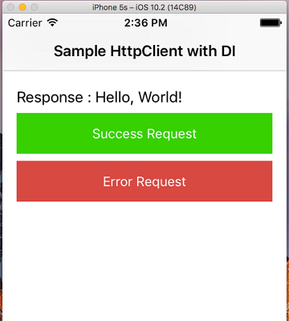
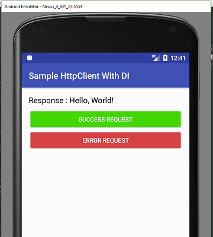

# Sample Http Client With Dependency Injection

I want common structure for android and ios platforms.
This repository is an ios project.
I have used [Typhoon](https://github.com/appsquickly/Typhoon) library for dependency injection in this repository.
I like Typhoon.

Android Project : https://github.com/huseyinozer/CommonHttpClientWithDependencyInjection-Dagger2-Android

All right, show me code.

## Declaring Http Client Interface

I need a http client on both platforms. Their methods and parameter's names should be same.

**For iOS (swift);**
```swift
protocol HttpClient  {
    func get(path: String,  onSuccess: @escaping (_ result: String?) -> Void, onError: @escaping (_ statusCode: Int, _ message: String?, _ error: Error) -> Void) -> Void
    func post(path: String, params: [String:String], onSuccess: @escaping (_ result: String?) -> Void, onError: @escaping (_ statusCode: Int, _ message: String?, _ error: Error) -> Void) -> Void
    func put(path: String, params: [String:String], onSuccess: @escaping (_ result: String?) -> Void, onError: @escaping (_ statusCode: Int, _ message: String?, _ error: Error) -> Void) -> Void
    func delete(path: String, params: [String:String], onSuccess: @escaping (_ result: String?) -> Void, onError: @escaping (_ statusCode: Int, _ message: String?, _ error: Error) -> Void) -> Void
}
```

**For Android;**
```java
public interface HttpClient {
    void get(String path, HttpSuccessListener successListener, HttpErrorListener errorListener);
    void post(String path, Map<String, String> params, HttpSuccessListener successListener, HttpErrorListener errorListener);
    void put(String path, Map<String, String> params, HttpSuccessListener successListener, HttpErrorListener errorListener);
    void delete(String path, HttpSuccessListener successListener, HttpErrorListener errorListener);
}
```

Okay, everything is all right.

## Implementing Http Client

I created a class with "DefaultHttpClient" name. I implemented httpclient interface.
I have used [Alamofire library](https://github.com/Alamofire/Alamofire) for networking operations in this project.

```swift
import Alamofire

class DefaultHttpClient: NSObject, HttpClient {

    var baseUrl : String!

    init(baseUrl:String) {
        self.baseUrl = baseUrl;
    }

    func get(path: String, onSuccess: @escaping (String?) -> Void, onError: @escaping (Int, String?, Error) -> Void) {
        request(method: .get, path: path, params: [:], onSuccess: onSuccess, onError: onError)
    }

    func post(path: String, params: [String : String], onSuccess: @escaping (String?) -> Void, onError: @escaping (Int, String?, Error) -> Void) {
        request(method: .post, path: path, params: params, onSuccess: onSuccess, onError: onError)
    }

    func put(path: String, params: [String : String], onSuccess: @escaping (String?) -> Void, onError: @escaping (Int, String?, Error) -> Void) {
        request(method: .put, path: path, params: params, onSuccess: onSuccess, onError: onError)
    }

    func delete(path: String, params: [String : String], onSuccess: @escaping (String?) -> Void, onError: @escaping (Int, String?, Error) -> Void) {
        request(method: .delete, path: path, params: params, onSuccess: onSuccess, onError: onError)
    }

    private func request(method: HTTPMethod, path: String, params: [String : String], onSuccess: @escaping (String?) -> Void, onError: @escaping (Int, String?, Error) -> Void) {
        ...
    }
}

```

## Dependency Injection With Typhoon Library

Yess. I have used Typhoon library for dependency injection. I declared an AppAssembly. I provided http client in the module.
HttpClient is singleton in application lifecycle.

[Typhoon documentation](https://github.com/appsquickly/Typhoon/wiki/Swift-Quick-Start)

**AppAssembly;**

```swift
import Typhoon

public class AppAssembly : TyphoonAssembly {

    public dynamic func viewController() -> Any {
        return TyphoonDefinition.withClass(ViewController.self) {
            (definition) in

            definition?.injectProperty(#selector(getter: ViewController.httpClient), with: self.httpClient())
            definition?.scope = TyphoonScope.singleton
        }
    }

    public dynamic func httpClient() -> Any {
        return TyphoonDefinition.withClass(DefaultHttpClient.self) {
            (definition) in

            definition?.useInitializer(Selector(("initWithBaseUrl:"))) {
                (initializer) in
                initializer?.injectParameter(with: "http://www.mocky.io/v2/")
            }
            definition?.scope = TyphoonScope.singleton
        }
    }
}

```

## How we use HttpClient?

### In iOS Project

**Inject HttpClient (swift);**

```swift
// Injected HttpClient
var httpClient : HttpClient!
```

**Make Request With HttpClient (swift);**

```swift
httpClient.get(path: "5904e13e10000015194f671f", onSuccess: { (result) in

    self.messageLabel.text = "Response : \(result ?? "")"

}, onError: { (statusCode, errorMessage, error) in

    self.messageLabel.text = "StatusCode : \(statusCode) \nError Message : \(errorMessage ?? "")"
})
```

### In Android Project

**Inject HttpClient;**

```java
@Inject
HttpClient httpClient;
```

**Make Request With HttpClient;**

```java
httpClient.get("5904e13e10000015194f671f", result -> {

    messageLabel.setText(String.format("Response : %s", result));

}, (statusCode, errorMessage, error) -> {

    messageLabel.setText(String.format("StatusCode : %s) \nError Message : %s", statusCode, errorMessage));

});
```

### Screenshots in project

 

### Happy Codings (:
